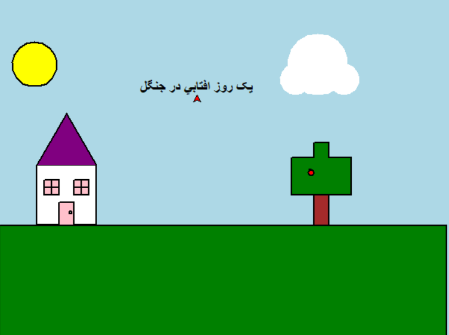
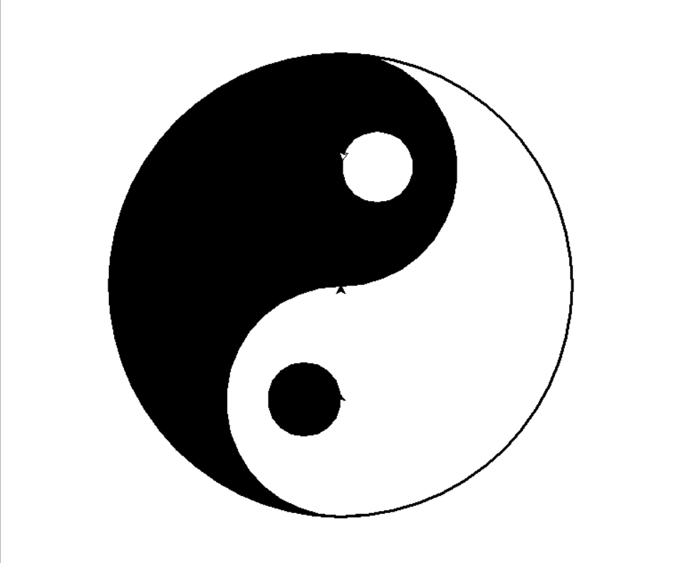
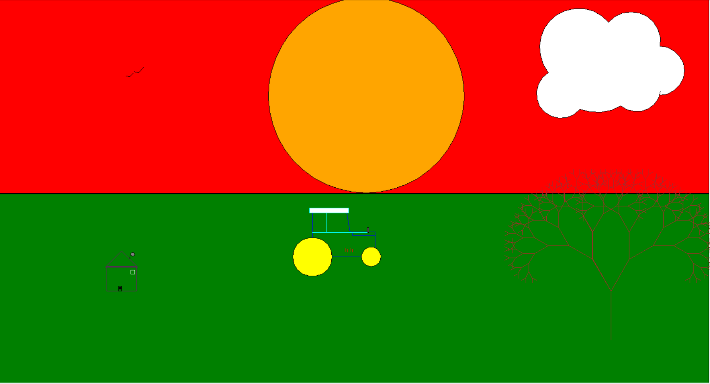
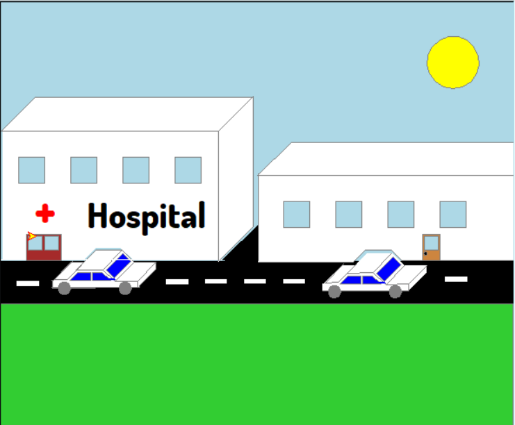
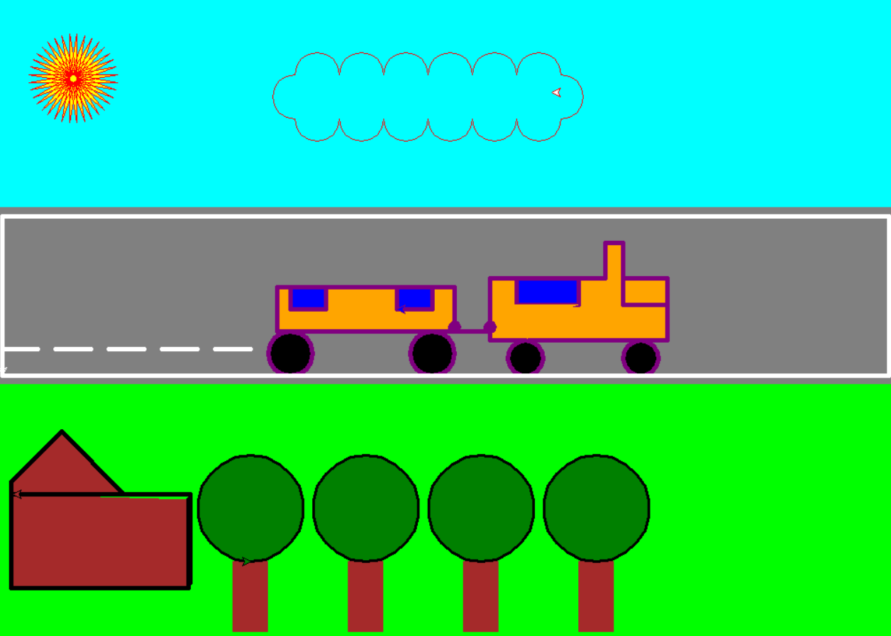

# Turtle_projects_Babol_kids
Hi everyone.

My name is Mohammad Rasul Azizi, a Python professor and programmer and a senior expert in artificial intelligence.

In this repository, I have put beautiful examples of my students' projects in the bootcamps of Babol city of Mazandaran province in Iran, in which they have been implemented in the field of painting using turtle in Python.

### Menu

+ <a href="#">project #1 : "The Nature" </a>
+ <a href="#">project #2 : "Kung Fu Logo"</a>
+ <a href="#">project #3 : "The Sunset Of The Farmer"</a>
+ <a href="#">project #4 : "City"</a>
+ <a href="#">project #5 : "City 2"</a>
+ <a href="#">project #6 : "FC Logo"</a>
+ <a href="#">project #7 : "Happy Birthday"</a>
+ <a href="#">project #8 : "Internet dinosaur"</a>
+ <a href="#">project #9 : "Tractor"</a>
+ <a href="#">project #10 : "Car"</a>
+ <a href="#">project #11 : "Car 2"</a>

<h3 id='p1'>project #1 : "The Nature" </h3>

__Developer :__ Shayan Ghorban Nejad

<h3 id='p1'>project #2 : "Kung Fu Logo" </h3>

__Developer :__ Danial Frozande

<h3 id='p1'>project #3 : "The Sunset Of The Farmer" </h3>

__Developer :__ Seid Aboulfazl Miri

<h3 id='p1'>project #4 : "City" </h3>

__Developer :__ Sam Afzali

<h3 id='p1'>project #4 : "City 2" </h3>

__Developer :__ Mohammad Sobhan Jaefarian

