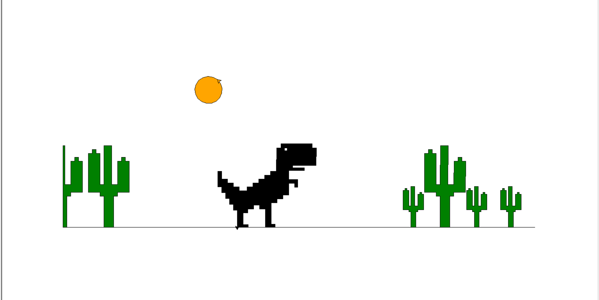

# Turtle_projects_Babol_kids
Hi everyone.

My name is Mohammad Rasul Azizi, a Python professor and programmer and a senior expert in artificial intelligence.

In this repository, I have put beautiful examples of my students' projects in the bootcamps of Babol city of Mazandaran province in Iran, in which they have been implemented in the field of painting using turtle in Python.

### Menu

+ <a href="#">project #1 : "The Nature" </a>
+ <a href="#">project #2 : "Kung Fu Logo"</a>
+ <a href="#">project #3 : "The Sunset Of The Farmer"</a>
+ <a href="#">project #4 : "City"</a>
+ <a href="#">project #5 : "City 2"</a>
+ <a href="#">project #6 : "FC Logo"</a>
+ <a href="#">project #7 : "Happy Birthday"</a>
+ <a href="#">project #8 : "Internet dinosaur"</a>
+ <a href="#">project #9 : "Tractor"</a>
+ <a href="#">project #10 : "Car"</a>
+ <a href="#">project #11 : "Car 2"</a>
+ <a href="#">project #12 : "Animation Car" </a>

---

<h3 id='p1'>project #1 : "The Nature" </h3>

__Developer :__ Shayan Ghorban Nejad

to access <a href="source project\Shayan Ghorban nejad (khone va jangale).py">Click here!</a>

---

<h3 id='p2'>project #2 : "Kung Fu Logo" </h3>

__Developer :__ Danial Frozande

to access <a href="source project\Danial Frozande (KongFu).py">Click here!</a>

---

<h3 id='p3'>project #3 : "The Sunset Of The Farmer" </h3>

__Developer :__ Seid Aboulfazl Miri

to access <a href="source project\seid Aboulfazl Miri (Ghorob Keshavarz).py">Click here!</a>

---

<h3 id='p4'>project #4 : "City" </h3>

__Developer :__ Sam Afzali

to access <a href="source project\Sam Afzali (Bimarestan va khiaban).py">Click here!</a>

---

<h3 id='p5'>project #5 : "City 2" </h3>

__Developer :__ Mohammad Sobhan Jaefarian

to access <a href="source project\Mohammad Sobhan Jaefarian (Ghatar).py">Click here!</a>

---

<h3 id='p6'>project #6 : "FC Logo" </h3>

__Developer :__ parsa GholamAli zadeh

to access <a href="source project\parsa GholamAli zadeh (EA Sport Logo).py">Click here!</a>

---

<h3 id='p7'>project #7 : "Happy Birthday" </h3>

__Developer :__ morteza mir agharezakhani 

to access <a href="source project\morteza mir_agharezakhani tavalodet mobark.py">Click here!</a>

---

<h3 id='p8'>project #8 : "Internet dinosaur" </h3>

__Developer :__ ilia Alizadeh Tabaghi

to access <a href="source project\ilia Alizadeh Tabaghi (dainasor).py">Click here!</a>

---

<h3 id='p9'>project #9 : "Tractor" </h3>

__Developer :__ Amir Mohammad Aboulfazl zadeh

to access <a href="source project\Amir Mohammad Aboulfazl zadeh (teractor).py">Click here!</a>

---

<h3 id='p10'>project #10 : "Car" </h3>

__Developer :__ Amir Mahdi Gholami 

to access <a href="source project\Amir Mahdi Gholami (Machine).py">Click here!</a>

--- 

<h3 id='p11'>project #11 : "Car" </h3>

__Developer :__ Aboulfazl Ahmadzade

to access <a href="source project\Aboulfazl Ahmadzade (Machine va Dokan).py">Click here!</a>

---

<h3 id='p12'>project #12 : "Animation Car" </h3>

__Developer :__ Amir Mohammad Valinatag

to access <a href="source project\Amir Mohammad Valinatag (Animation Machine).py">Click here!</a>

